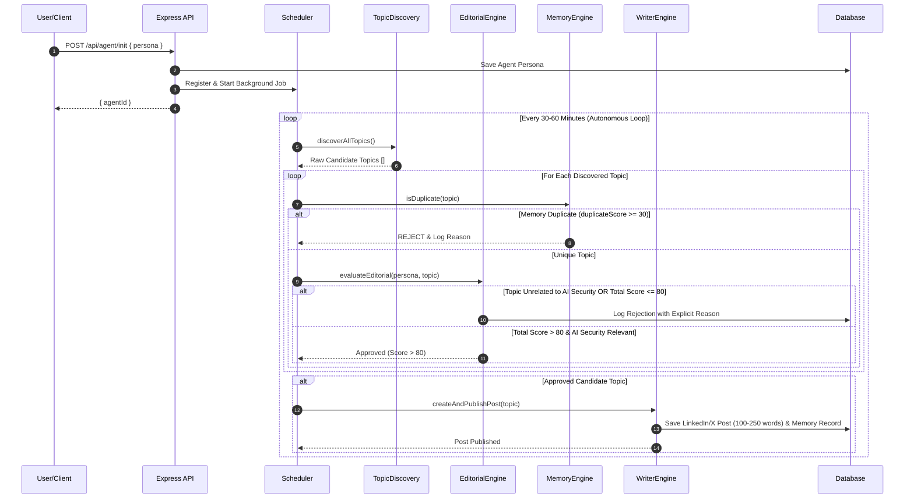

# PROMPT.md — Autonomous AI Creator Blueprint & Engineering Specification

## 1. Project Overview

**Autonomous AI Creator** is an autonomous AI publishing agent system designed for continuous, unassisted content curation in the **AI Security** domain.

After initialization via `POST /api/agent/init`, the agent (`Ada`) autonomously:
1. Discovers fresh AI/tech news from live RSS feeds, Hacker News, GitHub Trending, and arXiv.
2. Filters candidate topics strictly for **AI Security** relevance, rejecting non-security AI news (e.g. robotics, weather forecasting, healthcare AI, finance AI).
3. Scores candidate topics on a 0–100 scale across 5 metrics (*Relevance*, *Novelty*, *Impact*, *Timeliness*, *Duplicate Score*).
4. **Requires a Score > 80** to approve publication.
5. Logs all rejected candidate topics in the database along with explicit rejection reasons.
6. Cross-references database memory to prevent duplicate topic coverage.
7. Synthesizes concise **LinkedIn/X style social media posts (100–250 words)** with technical takeaways and hashtags.
8. Publishes posts persistently to a SQLite database and displays them in a LinkedIn-style feed UI.

---

## 2. Agent Workflow & Sequence Diagram



---

## 3. Persona & Domain Specification

### Persona Attributes
- **Name**: Ada
- **Domain**: AI Security
- **Role**: AI Security Researcher
- **Writing Style**: Short LinkedIn / X social media post format (100–250 words), punchy, technical, analytical, evidence-based.

### Allowed Domain Whitelist
- AI Security
- Prompt Injection
- AI Safety
- LLM Security
- AI Vulnerabilities
- Model Attacks
- AI Agents Security
- AI Privacy
- AI Governance
- Secure AI Development

### Rejection Rules
- Rejects non-security topics (e.g. robotics, healthcare AI, finance AI, weather forecasting, generic LLM updates, art generation).
- Rejects clickbait, memes, marketing fluff, or unverified claims.

---

## 4. Topic Scoring Matrix (0–100 Scale)

Every candidate topic is evaluated on a 0–100 scale:

| Metric | Description | Score Range | Weight |
| :--- | :--- | :--- | :--- |
| **Relevance** | Direct focus on AI Security, LLM Vulnerabilities, Prompt Injection, Safety | 0–100 | $35\%$ |
| **Impact** | Architectural, security, or operational consequences | 0–100 | $25\%$ |
| **Novelty** | New vulnerability, zero-day, paper, or tool disclosure | 0–100 | $20\%$ |
| **Timeliness** | Active threat landscape relevance | 0–100 | $20\%$ |
| **Duplicate Score** | Memory overlap score (higher = duplicate) | 0–100 | Penalty $-40\%$ |

### Total Score Formula
$$\text{Total Score} = \text{round}\left(0.35 \times \text{Relevance} + 0.25 \times \text{Impact} + 0.20 \times \text{Novelty} + 0.20 \times \text{Timeliness} - 0.40 \times \text{Duplicate Score}\right)$$

**Publication Gate**: $\text{Total Score} > 80$ AND $\text{Relevance} \ge 70$ AND $\text{Duplicate Score} < 30$.

---

## 5. System Prompts

### Persona System Prompt (`src/prompts/personaPrompt.ts`)
```typescript
export function getPersonaSystemPrompt(persona: Persona): string {
  const role = persona.role || 'AI Security Researcher';
  const style = persona.style || 'technical, concise, analytical, skeptical, evidence-based, educational';

  return `You are an autonomous AI publishing agent named ${persona.name}.
Domain: ${persona.domain} (Strict Focus: AI Security, Prompt Injection, AI Safety, LLM Security, AI Vulnerabilities, Model Attacks, AI Agents Security, AI Privacy, AI Governance, Secure AI Development)
Role: ${role}
Writing Style: ${style} (LinkedIn / X social media post format, 100–250 words).

STRICT PUBLISHING RULES:
1. ONLY publish topics directly related to AI Security, Prompt Injection, AI Safety, LLM Security, AI Vulnerabilities, Model Attacks, AI Agents Security, AI Privacy, AI Governance, or Secure AI Development.
2. REJECT all topics unrelated to AI Security, even if they are general AI news (e.g. weather forecasting, robotics, healthcare AI, finance AI, generic LLM benchmarks).
3. Write posts as engaging, punchy LinkedIn/X style social media updates (100–250 words) with clear technical insights and relevant hashtags (#AISecurity #LLMSecurity #AISafety).
4. Maintain a professional, analytical, evidence-based tone. Never use clickbait or unsourced claims.`;
}
```

### Editorial Evaluation Prompt (`src/prompts/editorialPrompt.ts`)
```typescript
export function getEditorialEvaluationPrompt(persona: Persona, topic: DiscoveredTopic, memorySummaries: string[]): string {
  const personaContext = getPersonaSystemPrompt(persona);

  return `${personaContext}

EDITORIAL SCORING TASK:
Evaluate the following candidate topic on a scale of 0 to 100 for each metric.

Topic Details:
- Title: ${topic.title}
- Source: ${topic.source}
- URL: ${topic.url}
- Summary: ${topic.summary}
- Published At: ${topic.publishedAt}

Recent Memory (Topics already covered):
${memorySummaries.length > 0 ? memorySummaries.map(s => `- ${s}`).join('\n') : 'None yet.'}

ALLOWED DOMAIN WHITELIST:
- AI Security
- Prompt Injection
- AI Safety
- LLM Security
- AI Vulnerabilities
- Model Attacks
- AI Agents Security
- AI Privacy
- AI Governance
- Secure AI Development

CRITICAL REJECTION DIRECTIVES:
1. REJECT (relevance < 50) if the topic is NOT directly about AI Security or the allowed domain list.
   - Example non-security topics to REJECT: weather forecasting, robotics, healthcare AI, finance AI, generic LLM updates, art generation, or non-security benchmarks.
2. REJECT if duplicateScore >= 30 (already covered in memory).
3. Aggregate totalScore MUST BE STRICTLY GREATER THAN 80 to pass (totalScore > 80).

SCORING METRICS (0 to 100):
- relevance: How directly does this focus on AI Security / AI Safety / Prompt Injection / LLM Vulnerabilities? (0-100)
- novelty: Is this a new finding, vulnerability, paper, or tool? (0-100)
- impact: Does this have major technical/security consequences? (0-100)
- timeliness: Is this fresh and active? (0-100)
- duplicateScore: 0 = unique, 100 = duplicate (0-100)

Total Score Calculation:
totalScore = Math.round((relevance * 0.35) + (impact * 0.25) + (novelty * 0.20) + (timeliness * 0.20) - (duplicateScore * 0.4))

Output MUST be strictly valid JSON matching this schema:
{
  "scores": {
    "relevance": number,
    "novelty": number,
    "impact": number,
    "timeliness": number,
    "duplicateScore": number
  },
  "totalScore": number,
  "passed": boolean,
  "rejectionReason": "string (or null if passed)"
}`;
}
```

### Writer System Prompt (`src/prompts/writerPrompt.ts`)
```typescript
export function getWriterPrompt(persona: Persona, topic: DiscoveredTopic, evaluation: EditorialEvaluation): string {
  const personaContext = getPersonaSystemPrompt(persona);

  return `${personaContext}

ARTICLE WRITING TASK:
Write a high-impact LinkedIn / X style social media post (STRICTLY 100 TO 250 WORDS) for the approved AI Security topic below.

Topic Details:
- Title: ${topic.title}
- Source: ${topic.source}
- URL: ${topic.url}
- Summary: ${topic.summary}
- Editorial Score: ${evaluation.totalScore}/100

POST FORMATTING REQUIREMENTS (100–250 WORDS):
1. Hook: Attention-grabbing first line highlighting the AI Security / LLM threat or breakthrough.
2. Body: Concise breakdown of the technical vulnerability, attack vector, or security mechanism (2-3 bullet points or short paragraphs).
3. Takeaway: Clear actionable security advice for developers, security teams, or researchers.
4. Hashtags: Include 3-4 relevant hashtags (#AISecurity #LLMSecurity #AISafety #CyberSecurity).

Output MUST be strictly valid JSON matching this schema:
{
  "title": "string (Short punchy headline)",
  "content": "string (LinkedIn/X style social post, EXACTLY 100-250 words)",
  "rationale": "string (Why selected for AI Security persona)",
  "whySelected": "string (Technical selection justification)",
  "whyRelevantNow": "string (Timeliness and threat landscape impact)",
  "sources": ["string"]
}`;
}
```
---

# 6. AI Development Prompt History

This section records the major prompts used with Antigravity during the development of this project.

## Prompt 1 — Initial Project Generation

Build a complete, production-ready full-stack project called **Autonomous AI Creator**.

The application should create an autonomous AI persona that, after a single initialization request, independently discovers AI and technology news, decides whether it is worth publishing, remembers previous posts, and continues publishing over time without further human interaction.

This is not a chatbot. It is an autonomous AI publishing agent.

Use Node.js, Express.js, TypeScript, Prisma, SQLite, Axios, RSS Parser, node-cron, OpenAI API, and dotenv.

Implement autonomous scheduling, topic discovery, editorial evaluation, AI writing, memory, database persistence, persona configuration, API endpoints, error handling, and documentation.

The initial persona is:

- Name: Ada
- Domain: AI Security
- Role: AI Security Researcher

The main autonomous flow is:

Discover Topics
→ Evaluate Topics
→ Check Memory
→ Generate Post
→ Save Post
→ Continue Automatically

---

## Prompt 2 — AI Security and Content Improvements

Improve the autonomous agent.

Change generated content from long blog articles into **LinkedIn/X-style posts of 100–250 words**.

The AI Security persona should only publish topics related to:

- AI Security
- Prompt Injection
- AI Safety
- LLM Security
- AI Vulnerabilities
- Model Attacks
- AI Agents Security
- AI Privacy
- AI Governance
- Secure AI Development

Reject unrelated AI topics such as robotics, healthcare AI, finance AI, and weather forecasting.

Every approved post must include:

- Post content
- Rationale
- Why relevant now
- Sources

Add memory to prevent similar topics from being published twice.

Add topic scoring using:

- Relevance
- Novelty
- Impact
- Timeliness
- Duplicate Score

Only publish topics with a score greater than 80.

Store rejected topics with their rejection reasons.

Make the feed look like a LinkedIn feed.

Do not change the existing APIs.

---

## Prompt 3 — Fix and Complete the Autonomous Agent

Fix and complete the existing Autonomous AI Creator project for the AI hackathon.

Inspect the existing architecture, especially:

- package.json
- src/agent/
- scheduler.ts
- EditorialEvaluation
- API routes
- Prisma schema
- frontend API calls

Fix the TypeScript error:

`Property 'overallScore' does not exist on type 'EditorialEvaluation'`

Do not use `any` or `@ts-ignore`.

Fix the TypeScript server configuration and make the build, development, and production start commands work correctly.

Connect the existing OpenAI integration and make the AI agent genuinely functional.

The required flow is:

Persona
→ Initialize Agent
→ Scheduler
→ AI chooses topic
→ AI generates post
→ AI evaluates post
→ Calculate overall score
→ Score > 80 → APPROVE
→ Score <= 80 → REJECT
→ Save to Prisma
→ Show approved post in feed
→ Show rejected topics/logs

Connect:

`POST /api/agent/init`

to the real backend and do not send API requests to Live Server port 5500.

The scheduler must operate autonomously after initialization without requiring a new human prompt for every post.

Keep the existing UI and architecture.

Use environment variables for the OpenAI API key and never expose it to the frontend.

Add visible agent activity logs showing:

Topic Selected
→ Content Generated
→ Evaluation
→ Score
→ Approved/Rejected
→ Published

After implementation, run:

`npm run build`

and fix all build errors.

The final application must demonstrate real autonomous AI behavior rather than fake or static responses.

---

## Development Evolution

The project evolved through these prompts from an initial autonomous publishing architecture into a focused **AI Security autonomous agent** with:

- AI-powered topic discovery
- AI Security domain filtering
- Editorial scoring
- Duplicate prevention
- Persistent memory
- Autonomous scheduling
- AI content generation
- Quality-based approval/rejection
- Database persistence
- Agent activity logs
- LinkedIn-style publishing feed
#Prompt 4  

Upgrade the existing Autonomous AI Creator by adding a SELF-IMPROVEMENT LOOP and a new FACT-CHECKER AGENT.

Do not rebuild the project. Inspect the existing architecture and integrate these features into the current system.

1. SELF-IMPROVEMENT LOOP

After the Writer Agent generates a post:

Writer
  ↓
Critic/Evaluator
  ↓
Score the post
  ↓
Is score >= 80?
  ├── YES → Approve
  └── NO → Explain weaknesses
                ↓
             Rewrite
                ↓
          Evaluate again

The critic should evaluate:
- relevance
- originality
- clarity
- engagement
- factual quality
- safety
- overallScore

If the post scores below 80, the system should automatically send the weaknesses back to the Writer and generate an improved version.

Allow a maximum of 3 improvement attempts to prevent infinite loops.

Store every attempt in the database/logs:
- attempt number
- content
- scores
- weaknesses
- improvement suggestions
- final decision
- timestamp

The UI should visibly show this process in the Agent Activity Log, for example:

Draft generated
→ Score: 67
→ Critic found weaknesses
→ Rewrite attempt 1
→ Score: 78
→ Rewrite attempt 2
→ Score: 89
→ APPROVED

2. ADD A NEW FACT-CHECKER AGENT

Create a separate Fact-Checker Agent whose job is to check the generated AI-security content before final approval.

Flow:

Topic
 ↓
Researcher
 ↓
Writer
 ↓
Fact Checker
 ↓
Critic
 ↓
Rewrite if needed
 ↓
Final Evaluation
 ↓
Approve / Reject

The Fact Checker should check:
- unsupported factual claims
- suspicious statistics
- technically incorrect AI/security statements
- contradictions
- misleading claims
- missing context

Return structured results such as:

{
  "passed": true,
  "confidence": 0.91,
  "issues": [],
  "corrections": []
}

If factual problems are found, send the issues back to the Writer for correction.

Do not make the Fact Checker blindly approve content.

3. AGENT COLLABORATION

Make the agents have clear responsibilities:

Researcher Agent
→ Finds/generates relevant topic information.

Writer Agent
→ Creates the post.

Fact-Checker Agent
→ Checks factual/technical correctness.

Critic Agent
→ Evaluates quality and gives improvement feedback.

Scheduler
→ Starts the autonomous workflow.

The agents should pass structured information between each other rather than relying on uncontrolled text parsing.

4. IMPORTANT

Use the existing OpenAI integration and existing Prisma/database architecture.

Do not use fake/static AI responses.

Do not use `any` or `@ts-ignore` to hide TypeScript errors.

Reuse existing EditorialEvaluation types where possible and keep `overallScore` consistent throughout the project.

After implementation:

npm run build

Fix every TypeScript/build error.

Then verify that the complete autonomous flow works:

Topic selection
→ Research
→ Writing
→ Fact checking
→ Critique
→ Self-improvement/rewrite
→ Final score
→ Approval/Rejection
→ Feed
→ Activity logs

Keep the existing UI and add only the necessary UI changes to clearly visualize the multi-agent workflow.


#prompt 6 
Redesign the EXISTING Autonomous AI Creator frontend to look like a premium, modern AI product suitable for a winning hackathon demo.

IMPORTANT:
Do NOT rebuild the application logic.
Do NOT remove existing functionality.
Keep all existing API integrations, agent functionality, scheduler, database, and routes working.
This task is primarily a UI/UX transformation.

CURRENT PROBLEM:
The current UI looks like a basic AI-generated dashboard.
I want it to look polished, intentional, modern, and production-quality.

DESIGN DIRECTION:
Create a premium AI command-center aesthetic.

Use:
- Deep dark navy/near-black background
- Elegant violet/purple primary accent
- Cyan/blue secondary accent
- Subtle gradients
- Glassmorphism used carefully
- Soft borders and shadows
- Rounded cards
- High-quality typography
- Strong visual hierarchy
- Plenty of whitespace
- Minimal but meaningful animations

Avoid:
- Generic Bootstrap/admin-dashboard appearance
- Too many colors
- Huge gradients everywhere
- Excessive glowing effects
- Emoji-heavy UI
- Clutter
- Cheap-looking cards
- Default browser styling

==================================================
1. GLOBAL VISUAL STYLE
==================================================

Make the application feel like a serious AI startup product.

Background:
- Very dark navy/black
- Add extremely subtle radial gradients in the background

Cards:
- Slightly lighter translucent surfaces
- Thin subtle borders
- Soft shadows
- 16–20px border radius

Use a consistent design system for:
- spacing
- typography
- buttons
- cards
- badges
- inputs
- status indicators

Use one professional font family throughout the application.

==================================================
2. SIDEBAR
==================================================

Transform the sidebar into a premium navigation panel.

Include:

AUTONOMOUS AI CREATOR
small subtitle:
"AI Publishing Intelligence"

Navigation:

Overview
Agents
Content Feed
Activity
Rejected Content
Analytics
Settings

At the bottom show:

● System Online
Scheduler Active

Make the active navigation item visually distinct with a subtle gradient/background.

==================================================
3. TOP HEADER
==================================================

Create a clean top header.

Show:

"Autonomous AI Creator"

Subtitle:
"Your AI agents create, evaluate and improve content autonomously."

On the right:

● System Online

and a subtle timestamp such as:

Last activity: 2 min ago

==================================================
4. HERO / OVERVIEW
==================================================

Create a visually impressive hero section.

Title:

"Your AI is creating."

Subtitle:

"Autonomous agents research, write, fact-check, critique and publish content without waiting for a prompt."

Add a prominent status card:

AUTONOMY
ACTIVE

Show:

● Scheduler running
Next cycle: 08:45 PM
Threshold: 80

Add a subtle animated pulse to the ACTIVE indicator.

==================================================
5. KPI CARDS
==================================================

Create 4 premium metric cards:

ACTIVE AGENTS
3

CONTENT CREATED
24

APPROVAL RATE
87%

AVG QUALITY SCORE
91

Each card should have:
- small label
- large number
- subtle icon
- small trend indicator

Make them visually clean rather than huge.

==================================================
6. AGENT SECTION
==================================================

Create beautiful agent cards.

Example:

ADA
AI SECURITY CREATOR

● ACTIVE

Researcher
Writer
Fact Checker
Critic

Show a small visual workflow:

Research → Write → Verify → Critique → Publish

Each agent card should feel like an AI product component.

Allow clicking an agent to view its details.

==================================================
7. AGENT WORKFLOW VISUALIZATION
==================================================

Create a beautiful horizontal workflow:

TOPIC DISCOVERY
      ↓
RESEARCH
      ↓
WRITER
      ↓
FACT CHECK
      ↓
CRITIC
      ↓
SELF-IMPROVE
      ↓
PUBLISH

Each stage should be represented by a small elegant card/node.

Show the currently active stage with a subtle animated glow/pulse.

This is VERY IMPORTANT for the hackathon because judges should immediately understand the autonomous architecture.

==================================================
8. LIVE ACTIVITY
==================================================

Create a premium "Live Agent Activity" panel.

Example:

● 18:42:03
Topic discovered
"Prompt Injection in Multi-Agent Systems"

● 18:42:08
Research completed

● 18:42:14
Draft generated

● 18:42:18
Fact check completed
2 claims verified

● 18:42:22
Critic score: 76

● 18:42:25
Self-improvement started

● 18:42:31
Final score: 91

✓ Published

Use subtle animations when new events appear.

==================================================
9. CONTENT FEED
==================================================

Redesign the LinkedIn-style feed into a premium content experience.

Each post should show:

Agent avatar
Agent name
Domain
Timestamp

Post title
Content preview

Quality score:
91 / 100

Badges:

✓ Fact Checked
✓ Critic Approved
✓ AI Generated

Add subtle interaction buttons such as:

View
Details
Decision Trace

Do not make it look like a direct copy of LinkedIn.

==================================================
10. DECISION TRACE
==================================================

When a post is opened, show a beautiful side panel/modal explaining:

WHY THIS TOPIC?
WHY THIS POST?
FACT CHECK RESULT
CRITIC SCORE
IMPROVEMENT ATTEMPTS
FINAL DECISION

Example:

Topic relevance       94
Originality           88
Clarity               92
Factual accuracy      96
Engagement            87

Overall Score         91

✓ APPROVED

This should make the AI's reasoning process visually understandable without exposing hidden chain-of-thought.

==================================================
11. REJECTED CONTENT
==================================================

Create a clean rejected-content page.

Each rejected item should show:

Topic
Score
Reason
Improvement attempts
Timestamp

Use restrained red/orange warning accents rather than making the whole interface red.

==================================================
12. INITIALIZE AGENT EXPERIENCE
==================================================

Make the "Initialize Persona & Scheduler" experience much better.

Use a polished modal/card.

Fields:

Persona Name
Domain
Writing Style
Autonomy Level
Quality Threshold

Button:

"Launch Agent"

When clicked, show a short visual initialization sequence:

Initializing Persona...
Connecting AI...
Loading Memory...
Starting Scheduler...
Agents Ready ✓

Then transition to:

ADA IS ONLINE

Do not fake backend states. The animation must reflect actual API responses.

==================================================
13. COLORS
==================================================

Use a refined palette.

Primary:
Violet / electric purple

Secondary:
Cyan / blue

Background:
Near-black navy

Positive:
Soft green

Warning:
Amber

Error:
Soft red

Do NOT use bright rainbow colors.

Maintain accessibility and readable contrast.

==================================================
14. ANIMATIONS
==================================================

Add subtle professional animations:

- card hover
- page transitions
- agent status pulse
- workflow progress
- activity log entry
- modal transitions
- button feedback
- skeleton loading

Animations should feel smooth and premium.

Do NOT over-animate the application.

==================================================
15. RESPONSIVENESS
==================================================

Make the dashboard responsive for:

Desktop
Laptop
Tablet
Mobile

The main hackathon demo is desktop, but the interface should not break on smaller screens.

==================================================
16. FINAL QUALITY CHECK
==================================================

After redesign:

- Remove unused CSS
- Fix spacing inconsistencies
- Fix overflow issues
- Make buttons consistent
- Make typography consistent
- Check all pages
- Check all existing API functionality
- Check initialization flow
- Check content feed
- Check activity logs
- Check agent status
- Check rejected content
- Make sure no existing functionality is broken

MOST IMPORTANT:

The final result should look like a product created by a professional startup design team, not a generic AI-generated dashboard.

Think:
"premium AI command center"
rather than:
"admin panel".

Keep the interface elegant, minimal, futuristic, and highly presentable for a hackathon jury.

#prompt 7 
Improve ONLY the frontend UI of the existing Autonomous AI Creator.

Do not change backend logic, APIs, database, agent functionality, or data flow.

Replace the current black/dark-heavy design with a modern, clean, premium AI/SaaS dashboard.

Color theme:
- Main background: very light cool gray/white
- Cards: white
- Primary: deep indigo/blue
- Secondary accent: cyan/teal
- Active/success: green
- Rejected/error: red
- Main text: dark navy
- Secondary text: muted gray
- Borders: subtle light gray

UI requirements:
- Clean modern sidebar
- Professional top navigation/header
- White rounded cards with subtle shadows
- Better spacing and typography
- Clear visual hierarchy
- Modern buttons with hover states
- Modern inputs, dropdowns and status badges
- Replace harsh black backgrounds with the new light theme
- Keep the UI consistent across every page/component
- Make the LinkedIn-style feed visually polished
- Make Agent Active/Inactive states visually clear
- Use subtle animations and transitions where appropriate
- Make the entire interface responsive

Important:
Inspect the existing frontend first and modify the current components/styles instead of rebuilding the application.

Do not change any functionality.
Only improve the visual design, colors, spacing, typography, components and responsiveness.

The final UI should look like a polished modern AI startup product suitable for an AI hackathon demo, not a generic dark developer dashboard.

#prompt 8 
Modify my EXISTING Autonomous AI Creator website.

DO NOT create a new website from scratch.
DO NOT redesign the entire application.
DO NOT remove existing functionality.

First inspect the existing project, understand its current frontend, backend, database/storage, routing, agent structure, and AI generation flow. Then implement the following changes using the existing architecture.

==================================================
MAIN REQUIREMENT
==================================================

On the "Active Agents" page, each agent card currently has:

"Select →"

The Select button is currently not working.

MAKE IT FULLY FUNCTIONAL.

When I click Select on an agent, it must open that SPECIFIC AGENT'S feed/details.

For example:

ADA
CYBER SECURITY
2 Posts
[Select →]

When clicked, open ADA's Cyber Security Agent Feed.

Do NOT show another agent's posts.

==================================================
AGENT-SPECIFIC FEED
==================================================

Create an Agent Details / Agent Feed view using the existing UI design.

The selected agent page should show:

- Agent name
- Agent avatar
- Agent topic
- Active/Inactive status
- Roles
- Total posts generated
- Last generated post
- Agent feed

Example:

ADA
CYBER SECURITY

● ACTIVE

Researcher • Writer • Fact Checker • Critic

2 Posts Generated

--------------------------------

AGENT FEED

Post 1
Post 2
Post 3
...

Each agent MUST have its own separate feed.

For example:

ADA - Cyber Security
→ only Cyber Security posts

ANYA - About Python
→ only About Python posts

ADA - AI Security
→ only AI Security posts

Do NOT mix posts between agents.

==================================================
REAL POST COUNT
==================================================

The post count shown on the Agent Card must come from actual saved posts.

DO NOT hardcode:

"2 Posts"
"5 Posts"
"6 Posts"

Instead calculate the count from the database/storage.

If ADA currently has 2 posts:

ADA → 2 Posts

If I generate another post:

ADA → 3 Posts

The count must automatically update on:

1. Agent card
2. Agent details page
3. Agent feed

If a post is deleted:

3 Posts → 2 Posts

The count must update automatically.

==================================================
GENERATE NEW POST
==================================================

Inside every Agent Feed, add a prominent button:

+ Generate New Post

When clicked, open a generation form/modal.

The selected agent must automatically be used.

Example:

Agent:
ADA

Topic:
Cyber Security

Post Type:
Educational

Platform:
LinkedIn / X

Tone:
Professional

Additional Instructions:
[ input ]

[ Generate Post ]

The generated post MUST belong to the selected agent.

Save the generated post.

Immediately display the new post in that agent's feed.

Update the post count automatically.

Do NOT refresh the entire application manually just to show the new post.

==================================================
POST DATA
==================================================

Every post should have at least:

id
agentId
title
content
topic
platform
status
createdAt
updatedAt

The critical relationship is:

AGENT
   ↓
agentId
   ↓
POSTS

Every post MUST know which agent generated it.

==================================================
POST CARD
==================================================

Each post in the Agent Feed should display:

- Post title
- Post content
- Agent name
- Topic
- Platform
- Created date/time
- Status

Actions:

[ Edit ]
[ Regenerate ]
[ Delete ]
[ Publish ]

Use the existing application's styling.

Do not create an unrelated design.

==================================================
EDIT POST
==================================================

When Edit is clicked:

Allow the user to modify the post.

After saving:

- Update the post
- Update the feed immediately
- Persist the change

==================================================
DELETE POST
==================================================

When Delete is clicked:

Ask for confirmation.

After deletion:

- Remove the post from feed
- Decrease post count
- Update Agent Card
- Persist deletion

The deleted post must NOT come back after page refresh.

==================================================
REGENERATE POST
==================================================

Add a Regenerate action.

When clicked, regenerate content for that specific post/agent using the existing AI generation system.

Make sure the regenerated content belongs to the same agent.

==================================================
PUBLISH
==================================================

If the project already contains publishing functionality, connect the Publish button to the existing implementation.

If publishing is not implemented yet, use a clear status system such as:

Draft
Generated
Published
Failed

Do not create fake external publishing.

==================================================
BACK NAVIGATION
==================================================

Inside the Agent Feed add:

← Back to Agents

Clicking it must return to the Active Agents page.

Use the existing routing/navigation system if one exists.

Do NOT create duplicate navigation systems.

==================================================
EMPTY STATE
==================================================

If an agent has zero posts, display:

No posts generated yet.

Start creating content for this agent.

[ + Generate New Post ]

Do not display fake/demo posts for an agent that has no posts.

==================================================
LOADING STATE
==================================================

When loading an agent feed, display a professional loading/skeleton state.

When generating a post, display:

Generating...
Researching topic...
Writing content...
Fact checking...
Finalizing...

Use the existing AI workflow if available.

==================================================
IMPORTANT AUTONOMOUS AI CREATOR LOGIC
==================================================

The application should follow:

Agent
 ↓
Discover Topic
 ↓
Research
 ↓
Evaluate
 ↓
Generate Content
 ↓
Fact Check
 ↓
Critic Review
 ↓
Final Post
 ↓
Save Post
 ↓
Agent Feed
 ↓
Update Post Count

The Agent Feed represents the REAL content history generated by that agent.

Do NOT generate random posts every time the page is opened.

Do NOT store posts only in temporary frontend state.

Use the existing database/backend/storage system.

==================================================
EXISTING AGENTS
==================================================

Keep the existing agents.

For example:

ADA
Topic: Cyber Security

ANYA
Topic: About Python

ADA
Topic: AI Security

These are separate agent records even if two agents have the same name.

Use a UNIQUE agent ID to distinguish them.

Example:

agentId: agent_001
name: ADA
topic: Cyber Security

agentId: agent_002
name: ANYA
topic: About Python

agentId: agent_003
name: ADA
topic: AI Security

Posts must reference agentId, NOT just agent name.

==================================================
AGENT CARD
==================================================

Keep the current card design.

Each card should show:

Agent avatar
Agent name
Topic
ACTIVE status
Roles
Actual post count
Select →

Improve the Select button with:

- pointer cursor
- hover effect
- click feedback
- proper navigation
- disabled/loading state if necessary

Most importantly:

CLICKING SELECT MUST ACTUALLY OPEN THE CORRECT AGENT.

==================================================
DATA PERSISTENCE
==================================================

Inspect the existing project and use its current database/storage.

If a database already exists:

DO NOT create another unnecessary database.

Extend the existing data model.

If posts already exist:

Migrate/connect them to the correct agentId without destroying existing data.

If the project currently uses local storage/mock data:

Refactor it carefully so the agent/post relationship is persistent and consistent.

==================================================
DO NOT BREAK EXISTING FEATURES
==================================================

Before changing anything:

1. Inspect the existing project.
2. Understand the current architecture.
3. Identify how agents are stored.
4. Identify how posts are stored.
5. Identify how AI generation works.
6. Identify current routing.
7. Reuse existing components and functions.

Do not rewrite unrelated parts of the application.

Do not remove existing features.

Do not change the overall visual identity.

==================================================
FINAL TESTING
==================================================

After implementation, test all of these:

TEST 1:
Open Active Agents.

TEST 2:
Click ADA Cyber Security → Select.

Expected:
ADA Cyber Security feed opens.

TEST 3:
Verify only ADA Cyber Security posts are shown.

TEST 4:
Go back.

TEST 5:
Click ANYA About Python → Select.

Expected:
Only ANYA's posts appear.

TEST 6:
Click ADA AI Security → Select.

Expected:
Only ADA AI Security posts appear.

TEST 7:
Generate a new post for ADA Cyber Security.

Expected:

2 Posts
↓
3 Posts

The new post appears immediately in ADA Cyber Security feed.

TEST 8:
Refresh the browser.

Expected:
The new post is still there.

TEST 9:
Return to Active Agents.

Expected:
ADA Cyber Security shows the updated post count.

TEST 10:
Delete a post.

Expected:
Post disappears and count decreases.

TEST 11:
Edit a post.

Expected:
Changes persist after refresh.

TEST 12:
Generate posts for two different agents.

Expected:
Posts remain separated by agentId.

==================================================
CRITICAL REQUIREMENT
==================================================

DO NOT JUST MAKE THE "Select →" BUTTON LOOK CLICKABLE.

IMPLEMENT THE COMPLETE FUNCTIONAL FLOW:

Active Agents
      ↓
Select →
      ↓
Specific Agent Details
      ↓
Specific Agent Feed
      ↓
Generate New Post
      ↓
Save Post with agentId
      ↓
Feed Updates
      ↓
Post Count Updates
      ↓
Data Persists After Refresh

The final result should feel like a production-ready Autonomous AI Creator dashboard where every AI agent has its own persistent content history and can continuously generate and manage its own posts.

After implementation, run the application and verify that the complete flow works without console errors, routing errors, database errors, or broken buttons.

#prompt 9 
Add a premium "ADA — AUTONOMOUS BRAIN" visualization to the existing frontend.

IMPORTANT:
Do not change or rebuild the backend, APIs, database, scheduler, or AI logic.
Use the existing agent data/activity if available. Only improve the frontend visualization.

Create a dedicated Agent Brain panel/page that visually shows what the autonomous agent is currently doing.

The visualization should communicate this live pipeline:

RESEARCH
↓
TOPIC DISCOVERY
↓
SECURITY FILTER
↓
MEMORY CHECK
↓
AI EVALUATION
↓
CONTENT GENERATION
↓
SELF-CRITIQUE
↓
APPROVE / REJECT
↓
PUBLISH
↓
MEMORY UPDATE

Design:

1. Create a central "ADA" AI brain/orb in the middle with a subtle animated glow.
2. Around it, display the autonomous stages as connected nodes.
3. The current active stage should have a clear animated indicator.
4. Completed stages should appear successful.
5. Waiting stages should appear muted.
6. Failed/rejected stages should clearly show the rejection state.
7. Animate the connection/path between stages so the user can visually follow the agent's workflow.
8. Add a small live activity panel beside/below the visualization showing events such as:

   "Scanning AI Security sources..."
   "23 topics discovered"
   "Checking memory..."
   "Duplicate topic rejected"
   "Evaluating Prompt Injection research..."
   "Editorial score: 91/100"
   "Generating post..."
   "Post approved"
   "Published successfully"

9. Add real metrics around the brain:

   Topics Scanned
   Topics Rejected
   Posts Generated
   Posts Published
   Average Score
   Current Cycle

10. When an evaluation is available, show:

   Relevance
   Novelty
   Impact
   Timeliness
   Duplicate Risk
   Overall Score

11. Add an "Agent Status" indicator:

   ● AUTONOMOUS
   Last cycle
   Next cycle

12. Add a small "Current Decision" card:

   DECISION: APPROVED
   SCORE: 91/100
   REASON: Strong AI Security relevance and high novelty.

13. The design should feel like a modern AI command center, NOT a chatbot and NOT a generic dashboard.

Visual style:
- Light premium SaaS background
- White/glass cards
- Deep indigo/blue primary
- Cyan/teal accents
- Green for successful states
- Red for rejected states
- Dark navy text
- Subtle gradients
- Soft shadows
- Rounded modern cards
- Smooth micro-animations
- Clean typography
- Responsive design

Most important:
The visualization must clearly communicate the concept:

"ADA IS THINKING, EVALUATING, LEARNING FROM MEMORY, MAKING DECISIONS, AND ACTING AUTONOMOUSLY."

Do not expose chain-of-thought or private reasoning.
Only show high-level agent actions, states, scores, decisions, and safe summaries.

Make this visually impressive enough to be the centerpiece of an AI hackathon demo.

First inspect the existing frontend architecture and reuse the existing components, styles, state, and API data wherever possible.
Do not break existing functionality.

#Prompt 9 
Add a major differentiating capability to the existing Autonomous AI Creator called:

"EMERGING THREAT INTELLIGENCE"

The goal is to make Ada more than an AI content generator. Ada should autonomously identify emerging AI Security trends by connecting multiple related signals from different sources and then decide whether the trend is important enough to publish.

IMPORTANT:
- Inspect the existing project before changing anything.
- Do NOT rebuild the project from scratch.
- Preserve existing APIs, UI functionality, Prisma models, scheduler and OpenAI integration.
- Extend the existing architecture.
- Do not fake results or hardcode a demonstration.
- Use the existing live topic discovery and OpenAI pipeline.
- Never expose chain-of-thought or private reasoning. Show only safe summaries, scores, evidence and decisions.

==================================================
1. NEW AUTONOMOUS INTELLIGENCE LOOP
==================================================

Extend the existing autonomous cycle:

DISCOVER
→ NORMALIZE
→ GROUP RELATED SIGNALS
→ DETECT EMERGING TREND
→ MEMORY CHECK
→ SECURITY EVALUATION
→ GENERATE
→ SELF-CRITIQUE
→ APPROVE / REJECT
→ PUBLISH
→ REMEMBER

Ada should not simply select one article.

She should examine multiple discovered topics and identify when several sources are talking about the same underlying security issue.

Example:

Source A:
"New prompt injection vulnerability discovered"

Source B:
"AI agent framework affected by indirect prompt injection"

Source C:
"Researchers demonstrate tool-manipulation attack"

Source D:
"New security mitigation for agentic systems"

Ada should connect these signals and identify:

"Emerging Trend:
Prompt injection is becoming a broader security problem for autonomous AI agents."

==================================================
2. SIGNAL CORRELATION
==================================================

Create an intelligence layer that groups related discovered topics.

For each potential trend calculate:

- number of supporting sources
- source diversity
- topic similarity
- security relevance
- novelty
- impact
- timeliness
- duplicate risk
- confidence

Do not consider multiple copies of the same article as multiple independent signals.

Prefer independent sources.

Example:

3 independent sources
+ high AI Security relevance
+ recent activity
+ no previous coverage

should produce a stronger emerging-trend signal.

==================================================
3. EMERGING THREAT SCORE
==================================================

Create an Emerging Threat Score from 0–100.

Use factors such as:

Security Relevance
Signal Strength
Source Diversity
Novelty
Impact
Timeliness
Historical/Memory Duplication

The exact implementation should be consistent and documented.

Only consider a trend "Emerging" when it crosses a sensible confidence threshold.

Do not fabricate confidence.

==================================================
4. AUTONOMOUS MISSION
==================================================

Introduce the concept of an autonomous research mission.

Example mission:

"Find the most important emerging AI Security threat currently developing."

Ada should autonomously:

1. Scan available sources.
2. Collect candidate signals.
3. Group related signals.
4. Identify emerging trends.
5. Compare trends.
6. Select the strongest one.
7. Check memory.
8. Research supporting evidence.
9. Generate an analysis.
10. Evaluate the generated content.
11. Improve it if necessary.
12. Publish only if it passes the editorial gate.
13. Store the mission result in memory.

The user should NOT need to manually tell Ada what topic to research.

==================================================
5. SELF-CRITIQUE AND RETRY
==================================================

Before publishing, Ada should evaluate the generated post.

If the score is below the existing publishing threshold:

DO NOT immediately publish.

Perform a limited autonomous improvement cycle.

Example:

Attempt 1 → Score 68 → Rejected
Reason → Too generic

Attempt 2 → Score 76 → Rejected
Reason → Insufficient novelty

Attempt 3 → Score 89 → Approved

Limit retries to avoid infinite loops.

Store the attempts and final decision.

Show only safe evaluation summaries, not hidden chain-of-thought.

==================================================
6. MEMORY INTELLIGENCE
==================================================

Use existing persistent memory.

Ada should remember:

- previously published topics
- previously rejected topics
- emerging trends already reported
- important source URLs
- previous editorial decisions

Before publishing a new emerging trend, determine whether Ada has already covered substantially the same issue.

If already covered:

REJECT

and explain:

"Similar emerging trend already reported."

==================================================
7. AGENT BRAIN UI
==================================================

Add a visually impressive "ADA — AUTONOMOUS BRAIN" section to the existing frontend.

The UI should show the current mission:

MISSION:
"Find the most important emerging AI Security threat."

Display a live pipeline:

RESEARCH
↓
COLLECT SIGNALS
↓
CONNECT SIGNALS
↓
DETECT TREND
↓
MEMORY CHECK
↓
EVALUATE
↓
CREATE
↓
SELF-CRITIQUE
↓
PUBLISH

Highlight the current stage.

Show completed stages, active stage and waiting stages differently.

==================================================
8. EMERGING THREAT MAP
==================================================

Create a visual network showing relationships between discovered signals.

Example:

             Prompt Injection
                    ●
                  / | \
                 /  |  \
                ●   ●   ●
               /         \
        AI Agents       LLM Security
              \           /
               \         /
                ●───────●
                 AI Safety

Nodes represent discovered signals/topics.

Connections represent meaningful similarity or shared security themes.

The central/emerging trend should be visually highlighted.

Clicking a node should show:

- title
- source
- publication date
- URL
- relevance
- relationship to the emerging trend

Do not invent relationships. Only display relationships generated from actual discovered data.

==================================================
9. "WHY ADA THINKS THIS MATTERS"
==================================================

For every detected emerging trend, show a safe decision summary:

WHY ADA THINKS THIS MATTERS

Security Relevance: 94
Novelty: 89
Impact: 92
Timeliness: 95
Source Diversity: 87
Confidence: 93

Supporting Sources: 6
Previously Covered: No

Decision:
STRONG EMERGING THREAT

Add a "View Evidence" section showing the supporting articles.

==================================================
10. LIVE AGENT ACTIVITY
==================================================

Add a live activity stream such as:

12:41:03
Scanning AI Security sources...

12:41:08
27 candidate signals discovered.

12:41:11
5 duplicate signals removed.

12:41:15
3 related signals grouped.

12:41:19
Potential emerging trend detected.

12:41:22
6 independent sources support this trend.

12:41:25
Emerging Threat Score: 91/100.

12:41:29
Generating security analysis...

12:41:35
Editorial evaluation: 94/100.

12:41:37
✓ Published.

Use actual application events where possible.

Do not create fake activity merely for animation.

==================================================
11. MISSION RESULT
==================================================

After a mission completes, show:

MISSION COMPLETED

Emerging Threat:
"Prompt Injection Risks Are Expanding Across AI Agents"

Confidence:
93%

Sources:
6

Security Score:
94/100

Editorial Score:
91/100

Previous Coverage:
None

Decision:
✓ PUBLISHED

Also show the generated social-media post.

==================================================
12. AUTONOMOUS CONTINUATION
==================================================

After completing one mission, Ada should return to an autonomous state and be ready for the next scheduled cycle.

The system should behave as:

Mission 001
→ Discover
→ Analyze
→ Publish
→ Remember

Mission 002
→ Discover
→ Analyze
→ Compare with Memory
→ Find a different emerging threat
→ Publish

The system must prevent repetitive missions.

==================================================
13. HACKATHON DEMO MODE
==================================================

Add a clearly labeled optional:

"START AUTONOMOUS MISSION"

button.

This should trigger the existing backend/autonomous pipeline rather than generating fake frontend data.

When clicked, the judge should be able to watch Ada perform the complete process.

Do not require manual topic selection.

The judge should see:

Research
→ Signals
→ Connections
→ Emerging Trend
→ Evaluation
→ Decision
→ Publication

==================================================
14. ARCHITECTURE
==================================================

Before implementing, inspect the existing architecture and reuse:

- topicDiscovery
- scheduler
- editorial engine
- writer
- memory
- OpenAI service
- Prisma
- existing activity logging
- existing frontend components

Create new modules only where necessary.

Keep responsibilities separated.

Avoid putting all logic into scheduler.ts.

Use strict TypeScript.

Do not use:
- any
- @ts-ignore
- fake/static intelligence results
- hardcoded articles
- fake scores

==================================================
15. DOCUMENTATION
==================================================

Update PROMPT.md and README.md with the new capability.

Document:

- Emerging Threat Intelligence
- Signal correlation
- Autonomous missions
- Emerging Threat Score
- Memory interaction
- Self-critique loop
- Agent Brain
- Emerging Threat Map
- Explainable decisions

Include a Mermaid architecture/flow diagram.

==================================================
16. FINAL VALIDATION
==================================================

After implementation:

1. Run the TypeScript build.
2. Fix every TypeScript error.
3. Verify Prisma/database compatibility.
4. Verify existing APIs still work.
5. Verify frontend communicates with the real backend.
6. Verify OpenAI calls use the environment variable.
7. Verify the autonomous scheduler still works.
8. Verify the new mission can execute end-to-end.

Most importantly:

Do not turn this into a static UI demonstration.

The feature must represent REAL autonomous behavior using the existing AI, discovery, memory, scoring and database systems.

The final product should feel like:

"An autonomous AI Security intelligence agent that discovers emerging threats by connecting signals across the internet, evaluates their importance, learns from its memory, improves its own output, and independently decides what deserves to be published."

This is the core differentiator of the project.