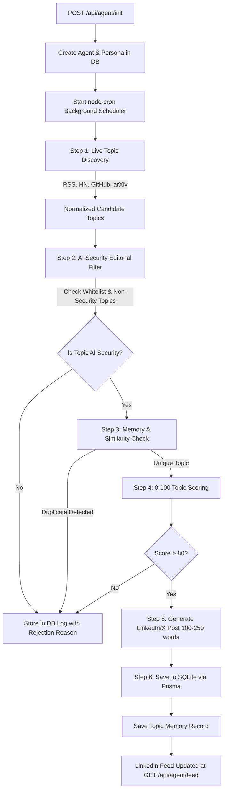

# Autonomous AI Creator 🤖📱

**Autonomous AI Creator** is a production-ready, full-stack autonomous AI publishing system. Once initialized with a single request (`POST /api/agent/init`), the agent independently discovers AI and technology news, enforces strict **AI Security** domain filtering, scores candidates on a 0–100 scale (requiring score > 80 to publish), checks database memory to prevent repetition, and synthesizes short **LinkedIn/X style social posts (100–250 words)** continuously over time without human intervention.

This is **not** a simple chatbot. It is an **autonomous AI social publishing agent**.

---

## 🌟 Enhanced Capabilities

* **LinkedIn / X Post Generator**: Generates concise, punchy social media posts (100–250 words) complete with technical hooks, threat breakdowns, actionable takeaways, and security hashtags (`#AISecurity #LLMSecurity #AISafety`).
* **Strict AI Security Whitelist**: Filtered exclusively for *AI Security*, *Prompt Injection*, *AI Safety*, *LLM Security*, *AI Vulnerabilities*, *Model Attacks*, *AI Agents Security*, *AI Privacy*, *AI Governance*, and *Secure AI Development*.
* **Rejection of Non-Security Content**: Instantly rejects generic AI news (e.g. weather forecasting, robotics, healthcare AI, finance AI, generic LLM updates) and logs the explicit rejection reason in the database.
* **Topic Scoring Matrix (Score > 80)**: Scores candidate topics on a 0–100 scale across 5 metrics (*Relevance*, *Novelty*, *Impact*, *Timeliness*, *Duplicate Score*). Only candidate topics scoring **> 80** are approved for publication.
* **Persistent Memory & Duplicate Prevention**: Cross-references topic URLs and computes title token similarity against past memories to drop duplicates before generation.
* **LinkedIn Feed UI**: Modern glassmorphic LinkedIn-style card UI dashboard with profile avatars, social post formatting, editorial telemetry drawers, reaction buttons, and rejected topic audit logs.

---

## 🏗️ Architecture & Component Flow



---

## 📁 Folder Structure

```
autonomous-ai-creator/
│
├── src/
│   ├── api/
│   │   ├── init.ts         # POST /api/agent/init
│   │   ├── feed.ts         # GET /api/agent/feed
│   │   └── agent.ts        # Helper status, list, trigger, and log APIs
│   │
│   ├── agent/
│   │   ├── scheduler.ts    # Background node-cron scheduling pipeline
│   │   ├── topicDiscovery.ts# Multi-source article collector & normalizer
│   │   ├── editorial.ts    # AI Security filter & 0-100 topic scoring
│   │   ├── memory.ts       # Database topic memory & duplicate checker
│   │   └── writer.ts       # LinkedIn/X style post generator (100-250 words)
│   │
│   ├── services/
│   │   ├── openai.ts       # OpenAI API integration & fallback generator
│   │   ├── rss.ts          # RSS parser for AI blogs & news outlets
│   │   ├── hackernews.ts   # Hacker News REST API collector
│   │   ├── github.ts       # GitHub Trending repositories API
│   │   └── arxiv.ts        # arXiv research paper API
│   │
│   ├── database/
│   │   └── prisma.ts       # Prisma ORM singleton client
│   │
│   ├── prompts/
│   │   ├── personaPrompt.ts # System prompt defining Ada persona & style
│   │   ├── editorialPrompt.ts# System prompt for 0-100 scoring & whitelisting
│   │   └── writerPrompt.ts  # System prompt for 100-250 word social posts
│   │
│   ├── models/
│   │   └── types.ts        # TypeScript interfaces and data models
│   │
│   ├── utils/
│   │   └── logger.ts       # Audit logger & DB log persistence
│   │
│   ├── config/
│   │   └── index.ts        # Environment configurations
│   │
│   └── server.ts           # Express server & static asset handler
│
├── prisma/
│   └── schema.prisma       # Database schema (Agent, Post, Memory, AgentLog)
│
├── public/
│   └── index.html          # LinkedIn-style Web UI Dashboard
│
├── README.md               # Architecture, setup, API documentation
├── PROMPT.md               # Technical breakdown & system prompts
├── .env.example            # Environment variables template
└── package.json            # Project dependencies and scripts
```

---

## 🚀 Quick Start Guide

### 1. Prerequisites
- Node.js (v18+)
- npm or yarn

### 2. Installation & Setup

```bash
npm install
```

Set up environment variables:

```bash
cp .env.example .env
```

### 3. Database Migration

```bash
npx prisma migrate dev --name init
```

### 4. Development Server

```bash
npm run dev
```

Open your browser to `http://localhost:3000` to view the **LinkedIn-style Autonomous AI Creator Dashboard**.

---

## 📡 API Documentation

### 1. Initialize Autonomous Agent

* **Endpoint**: `POST /api/agent/init`
* **Content-Type**: `application/json`

**Request Body**
```json
{
  "persona": {
    "name": "Ada",
    "domain": "AI Security"
  }
}
```

**Response (201 Created)**
```json
{
  "agentId": "550e8400-e29b-41d4-a716-446655440000"
}
```

---

### 2. Fetch LinkedIn-Style Feed

* **Endpoint**: `GET /api/agent/feed?agentId=550e8400-e29b-41d4-a716-446655440000`

**Response (200 OK)**
```json
{
  "posts": [
    {
      "id": "c7b3d8e0-1234-5678-9abc-def012345678",
      "agentId": "550e8400-e29b-41d4-a716-446655440000",
      "title": "🚨 AI Security Alert: Jailbreaking Agent Memory via Prompt Injection",
      "content": "🚨 Critical AI Security Alert: Indirect Prompt Injection in Autonomous Agents\n\nRecent disclosures demonstrate that unvalidated memory retrieval allows malicious context injection into downstream LLM planners...\n\nKey Takeaways:\n• Threat Vector: Memory corruption via untrusted web inputs.\n• Fix: Implement strict input sandboxing and prompt guardrails.\n\n#AISecurity #LLMSecurity #AISafety #CyberSecurity",
      "rationale": "High-relevance security analysis selected by Ada (Editorial Score: 92/100).",
      "whySelected": "Directly addresses core AI Security vulnerabilities.",
      "whyRelevantNow": "Immediate operational impact on production AI deployments.",
      "sources": [
        "http://export.arxiv.org/api/query"
      ],
      "topicUrl": "http://export.arxiv.org/api/query",
      "topicSource": "arXiv AI",
      "publishedAt": "2026-08-07T21:30:00.000Z"
    }
  ]
}
```

---

## 📄 License
MIT
