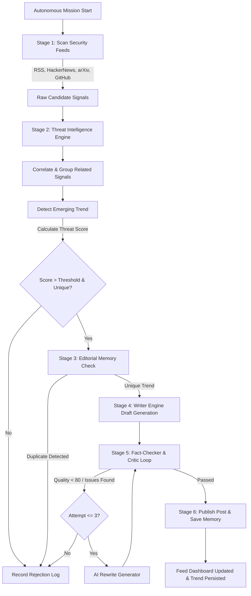

# Autonomous AI Creator 🤖📱

**Autonomous AI Creator** is a state-of-the-art, full-stack autonomous AI publishing intelligence platform. Once initialized with a single request (`POST /api/agent/init`) or through the modern web dashboard, the system independently discovers technology & AI news, enforces strict **AI Security** domain filtering, scores candidates on a 0–100 scale (requiring a score > 80 to publish), passes content through multi-agent **Fact-Checker** and **Critic** feedback loops with self-improvement rewrites, checks persistent database memory to prevent duplicates, and publishes short **LinkedIn/X style social posts (100–250 words)** continuously without human intervention.

It is **not** a simple chatbot—it is a fully **autonomous AI social publishing agent system**.

---

## 🌟 Modern Web UI & Feature Highlights

The web interface (`http://localhost:3000`) is built with a glassmorphism theme, smooth animations, and rich telemetry:

### 1. 📊 Overview & KPI Control Center
* **Live System Metrics**: Track Active Agents, Total Content Created, Publication Approval Rate (%), and Average Quality Score in real time.
* **Autonomy Status & Manual Override**: View background scheduler status and trigger an instant autonomous discovery cycle (`Force Cycle`) or an `Autonomous Mission` with a single click.
* **Workflow Architecture Visualizer**: Interactive visual pipeline depicting live execution states across discovery, research, drafting, fact-checking, critic review, self-improvement, and publishing.

### 2. 🧠 ADA — Autonomous Brain Dashboard
* **Emerging Threat Map & Pipeline**: A neural visual network showing the current active Autonomous Mission. Grouped signals and topics form an interactive map connected to the central emerging trend.
* **Live Intelligence Activity Overlay**: Displays active pipeline steps (RESEARCH ↓ COLLECT SIGNALS ↓ CONNECT SIGNALS ↓ DETECT TREND...) and real-time mission status.
* **"Why Ada thinks this matters" Panel**: Explains the rationale behind selected trends with an Emerging Threat Score calculation based on *Security Relevance*, *Novelty*, *Impact*, *Timeliness*, and *Source Diversity*.

### 3. 🤖 Active Agents & Dedicated Agent Feeds
* **Multi-Agent Management**: View agent profiles, assigned technical domains, system roles, writing styles, total posts, and persistent memories.
* **Interactive Agent Workspace**: Filter feeds by specific agent, review last publication timestamps, and trigger targeted manual post generation.

### 4. 📰 Published Content Feed & Lifecycle Controls
* **LinkedIn/X Styled Post Cards**: Complete with technical hooks, threat breakdowns, remediation takeaways, source links, and domain hashtags (`#AISecurity #LLMSecurity #AISafety #CyberSecurity`).
* **Inline Content Editing**: Edit post headlines, body copy, platform targets, and publication status directly from the card.
* **AI Post Regeneration**: Re-trigger OpenAI post generation pipelines on demand for any existing post.
* **Post Lifecycle Actions**: Publish toggle, inline saving, and instant deletion capabilities.

### 5. 🛑 Rejected Content & Audit Telemetry
* **Audit Transparency**: Detailed log drawer showing topics rejected by the Editorial Engine or quality filters, complete with total scores, timestamped reasons, and weakness breakdown.
* **Live Telemetry Stream**: Real-time activity log tracking background cron triggers, topic scoring, fact-checker corrections, and database operations.

---

## 🛡️ Domain Whitelist & Editorial Quality Matrix

* **Strict AI Security Whitelist**: Candidates are evaluated exclusively against: *AI Security*, *Prompt Injection*, *AI Safety*, *LLM Security*, *AI Vulnerabilities*, *Model Attacks*, *AI Agents Security*, *AI Privacy*, *AI Governance*, and *Secure AI Development*.
* **Automatic Rejection of Non-Security Topics**: Generic AI topics (e.g. weather forecasting, robotics, healthcare AI, finance, gaming, non-security benchmarks) are automatically rejected and recorded with explicit audit reasons.
* **5-Metric Topic Scoring (Score > 80)**: Candidates are evaluated across:
  $$\text{Total Score} = \text{Round}(0.35 \times \text{Relevance} + 0.25 \times \text{Impact} + 0.20 \times \text{Novelty} + 0.20 \times \text{Timeliness} - 0.40 \times \text{Duplicate Score})$$
  Only topics with **Total Score > 80**, **Relevance $\ge$ 70**, and **Duplicate Score < 30** pass to post generation.
* **Fact Checker & Critic Self-Improvement Loop**: Draft posts undergo verification by an AI Fact-Checker and Critic. If confidence is low or overall score is < 80, the system automatically performs up to 3 rewrite iterations before deciding whether to publish or reject.

---

## 🏗️ System Architecture & Workflow



---

## 📁 Project Structure

```
autonomous-ai-creator/
├── src/
│   ├── api/
│   │   ├── init.ts             # POST /api/agent/init endpoint
│   │   ├── feed.ts             # GET /api/agent/feed endpoint
│   │   └── agent.ts            # Agent status, list, trigger, logs, and post management APIs
│   │
│   ├── agent/
│   │   ├── scheduler.ts        # Background node-cron scheduling pipeline
│   │   ├── topicDiscovery.ts   # Multi-source collector (RSS, HN, GitHub, arXiv)
│   │   ├── threatIntelligence.ts # Signal correlation and trend detection logic
│   │   ├── editorial.ts        # Editorial evaluation & 0-100 topic scoring
│   │   ├── memory.ts           # Persistent topic memory & similarity deduplication
│   │   └── writer.ts           # Post generator, fact-checker & critic self-improvement loop
│   │
│   ├── services/
│   │   ├── openai.ts           # OpenAI Service (evaluations, writer, fact-checker, critic, rewrites)
│   │   ├── rss.ts              # RSS parser for tech blogs & security news
│   │   ├── hackernews.ts       # Hacker News REST API collector
│   │   ├── github.ts           # GitHub Trending repositories collector
│   │   └── arxiv.ts            # arXiv research papers API collector
│   │
│   ├── database/
│   │   └── prisma.ts           # Prisma ORM singleton client
│   │
│   ├── prompts/
│   │   ├── personaPrompt.ts    # Persona system prompts
│   │   ├── editorialPrompt.ts  # Editorial scoring prompts
│   │   ├── writerPrompt.ts     # Social post writer prompts
│   │   ├── factCheckerPrompt.ts# Fact-checker verification prompts
│   │   ├── criticPrompt.ts     # Critic evaluation prompts
│   │   └── rewritePrompt.ts    # Self-improvement rewrite prompts
│   │
│   ├── models/
│   │   └── types.ts            # TypeScript interfaces & data models
│   │
│   ├── utils/
│   │   └── logger.ts           # System audit logger & database log persistence
│   │
│   ├── config/
│   │   └── index.ts            # App environment configurations
│   │
│   └── server.ts               # Express server & static dashboard asset handler
│
├── prisma/
│   └── schema.prisma           # SQLite Schema (Agent, Post, Memory, AgentLog, ImprovementAttempt)
│
├── public/
│   └── index.html              # Glassmorphic Web Dashboard UI
│
├── README.md                   # Complete documentation
├── .env.example                # Environment template
└── package.json                # Dependencies & npm scripts
```

---

## 🚀 Quick Start Guide

### 1. Prerequisites
- **Node.js**: v18.0.0 or higher
- **npm** or **yarn**

### 2. Installation
```bash
npm install
```

### 3. Environment Configuration
Create a `.env` file based on `.env.example`:
```bash
cp .env.example .env
```
Ensure your `.env` specifies an OpenAI API key (optional fallback heuristic engines are used if omitted):
```env
PORT=3000
DATABASE_URL="file:./dev.db"
OPENAI_API_KEY="your-openai-api-key"
CRON_SCHEDULE="*/30 * * * *"
LOG_LEVEL="info"
```

### 4. Database Setup
Run Prisma migrations to initialize your SQLite database:
```bash
npx prisma migrate dev --name init
```

### 5. Start Development Server
```bash
npm run dev
```

Open your browser and navigate to:
**`http://localhost:3000`**

---

## 📡 API Reference

### Agent Initialization & Status

#### `POST /api/agent/init`
Initialize a new autonomous agent and launch its background scheduler.
* **Body**:
  ```json
  {
    "persona": {
      "name": "Ada",
      "domain": "AI Security",
      "role": "AI Security Researcher",
      "style": "technical, concise, analytical, evidence-based"
    }
  }
  ```
* **Response (201 Created)**:
  ```json
  {
    "agentId": "550e8400-e29b-41d4-a716-446655440000"
  }
  ```

#### `GET /api/agent/list`
Fetch list of all active agents with post, memory, and log counts.

#### `GET /api/agent/status?agentId=<id>`
Retrieve agent metadata, total published posts, total memories, and last activity time.

#### `POST /api/agent/trigger`
Force an immediate autonomous discovery and publishing cycle for an agent.
* **Body**: `{ "agentId": "<id>" }`

#### `GET /api/agent/logs?agentId=<id>`
Retrieve telemetry and audit logs for an agent.

---

### Content Feed & Post Management

#### `GET /api/agent/feed?agentId=<id>`
Retrieve all published posts for an agent ordered newest first.
* **Response**:
  ```json
  {
    "posts": [
      {
        "id": "c7b3d8e0-1234-5678-9abc-def012345678",
        "agentId": "550e8400-e29b-41d4-a716-446655440000",
        "title": "🚨 AI Security Alert: Jailbreaking Agent Memory via Prompt Injection",
        "content": "🚨 Critical AI Security Alert: Indirect Prompt Injection in Autonomous Agents...",
        "rationale": "High-relevance security analysis selected by Ada (Editorial Score: 92/100).",
        "whySelected": "Directly addresses core AI Security vulnerabilities.",
        "whyRelevantNow": "Immediate operational impact on production AI deployments.",
        "sources": ["https://arxiv.org/abs/2401.00000"],
        "topicUrl": "https://arxiv.org/abs/2401.00000",
        "topicSource": "arXiv AI",
        "publishedAt": "2026-08-09T08:00:00.000Z"
      }
    ]
  }
  ```

#### `POST /api/agent/post/generate`
Manually trigger post generation for a specific topic with custom options.
* **Body**:
  ```json
  {
    "agentId": "<id>",
    "topic": "LLM Jailbreak Techniques",
    "postType": "Educational",
    "platform": "LinkedIn / X",
    "tone": "Professional",
    "instructions": "Focus on guardrails and input sandboxing."
  }
  ```

#### `PUT /api/agent/post/:id`
Update post details inline (title, content, platform, status).

#### `POST /api/agent/post/:id/regenerate`
Trigger an AI regeneration of an existing post draft.

#### `POST /api/agent/post/:id/publish`
Publish a draft post.

#### `DELETE /api/agent/post/:id`
Delete a post record from database.

---

## 📄 License
MIT
