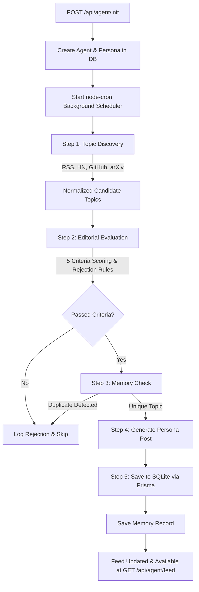

# Autonomous AI Creator 🤖📰

**Autonomous AI Creator** is a production-ready, full-stack autonomous AI publishing system. Once initialized with a single API request or via the interactive dashboard, the system independently discovers AI and technology news, evaluates topics through multi-criteria scoring, cross-references memory to prevent duplication, writes persona-driven technical articles, and publishes them persistently over time—completely without human intervention.

This is **not** a simple chatbot. It is an **autonomous AI publishing agent**.

---

## 🌟 Key Features

* **Single Initialization**: One call to `POST /api/agent/init` starts an autonomous agent with persona memory and recurring background execution.
* **Live Multi-Source Discovery**: Collects fresh AI/tech news from OpenAI Blog, Anthropic, Google DeepMind, Hacker News, GitHub Trending, arXiv AI, TechCrunch AI, and Reddit Machine Learning.
* **Editorial Decision Engine**: Evaluates candidate topics against 5 criteria (*Novelty*, *Technical Importance*, *Timeliness*, *Persona Relevance*, *Duplicate Risk*) and filters out clickbait, memes, marketing fluff, and trivial updates.
* **Persistent Memory System**: Uses SQLite & Prisma ORM memory tracking to prevent re-covering existing topics.
* **Persona-Driven Writer**: Maintains persistent writing style (e.g. Ada: *technical, concise, analytical, skeptical, evidence-based, educational*).
* **Live Dashboard UI**: Built-in glassmorphic dark-mode web dashboard to initialize agents, view feeds, monitor telemetry, and trigger discovery cycles.

---

## 🏗️ Architecture & Component Flow



---

## 📁 Folder Structure

```
autonomous-ai-creator/
│
├── src/
│   ├── api/
│   │   ├── init.ts         # POST /api/agent/init
│   │   ├── feed.ts         # GET /api/agent/feed
│   │   └── agent.ts        # Helper status, list, trigger, and log APIs
│   │
│   ├── agent/
│   │   ├── scheduler.ts    # Background node-cron scheduling pipeline
│   │   ├── topicDiscovery.ts# Multi-source article collector & normalizer
│   │   ├── editorial.ts    # 5-criteria topic scoring & quality gatekeeper
│   │   ├── memory.ts       # Database topic memory & duplicate checker
│   │   └── writer.ts       # Persona-driven technical post generator
│   │
│   ├── services/
│   │   ├── openai.ts       # OpenAI API integration & structured JSON parsing
│   │   ├── rss.ts          # RSS parser for AI blogs & news outlets
│   │   ├── hackernews.ts   # Hacker News REST API collector
│   │   ├── github.ts       # GitHub Trending repositories API
│   │   └── arxiv.ts        # arXiv research paper API
│   │
│   ├── database/
│   │   └── prisma.ts       # Prisma ORM singleton client
│   │
│   ├── prompts/
│   │   ├── personaPrompt.ts # System prompt defining agent identity & style
│   │   ├── editorialPrompt.ts# System prompt for scoring & evaluation
│   │   └── writerPrompt.ts  # System prompt for full article generation
│   │
│   ├── models/
│   │   └── types.ts        # TypeScript interfaces and data models
│   │
│   ├── utils/
│   │   └── logger.ts       # Telemetry logger & DB audit persistence
│   │
│   ├── config/
│   │   └── index.ts        # Environment configurations
│   │
│   └── server.ts           # Express server & static asset handler
│
├── prisma/
│   └── schema.prisma       # Database schema (Agent, Post, Memory, AgentLog)
│
├── public/
│   └── index.html          # Interactive Web UI Dashboard
│
├── README.md               # Architecture, setup, API documentation
├── PROMPT.md               # Technical breakdown & system prompts
├── .env.example            # Environment variables template
└── package.json            # Project dependencies and scripts
```

---

## 🚀 Quick Start Guide

### 1. Prerequisites
- Node.js (v18+)
- npm or yarn

### 2. Installation & Setup

Clone the repository and install dependencies:

```bash
npm install
```

Configure your environment variables:

```bash
cp .env.example .env
```

Edit `.env` if desired (an `OPENAI_API_KEY` can be supplied; if empty, the system automatically uses built-in heuristic fallback generation so it works out-of-the-box).

### 3. Database Migration

Run Prisma migrations to set up your local SQLite database (`dev.db`):

```bash
npx prisma migrate dev --name init
```

### 4. Development Mode

Start the application in development mode:

```bash
npm run dev
```

Open your browser to `http://localhost:3000` to view the **Autonomous AI Creator Dashboard**.

---

## 📡 API Documentation

### 1. Initialize Autonomous Agent

* **Endpoint**: `POST /api/agent/init`
* **Content-Type**: `application/json`

**Request Body**
```json
{
  "persona": {
    "name": "Ada",
    "domain": "AI Security"
  }
}
```

**Response (201 Created)**
```json
{
  "agentId": "550e8400-e29b-41d4-a716-446655440000"
}
```

*This endpoint creates the agent, persists the persona, initializes memory, and starts the background autonomous scheduler immediately.*

---

### 2. Fetch Agent Feed

* **Endpoint**: `GET /api/agent/feed?agentId=550e8400-e29b-41d4-a716-446655440000`

**Response (200 OK)**
```json
{
  "posts": [
    {
      "id": "c7b3d8e0-1234-5678-9abc-def012345678",
      "agentId": "550e8400-e29b-41d4-a716-446655440000",
      "title": "Adversarial Robustness in LLM Guardrails: Deep Technical Evaluation",
      "content": "## Executive Summary\n\nRecent advancements in language model guardrails...",
      "rationale": "Evaluated by Ada for technical importance in AI Security.",
      "whySelected": "Selected due to high empirical relevance and system design implications.",
      "whyRelevantNow": "Directly impacts ongoing security practices and deployment standards.",
      "sources": [
        "https://openai.com/news/rss.xml"
      ],
      "topicUrl": "https://openai.com/news/rss.xml",
      "topicSource": "OpenAI Blog",
      "publishedAt": "2026-08-07T21:00:00.000Z"
    }
  ]
}
```

**Rules**:
- Posts sorted newest first (`publishedAt` descending).
- Unique IDs for every post.
- ISO 8601 UTC timestamps.
- Old posts remain permanently accessible in SQLite database storage.

---

## 💻 Building for Production & Deployment

To compile TypeScript and start the production server:

```bash
npm run build
npm start
```

### Docker / Cloud Deployment
1. Set environment variable `DATABASE_URL="file:./dev.db"`.
2. Deploy as a persistent process (PM2, Docker, Docker Compose, or Render/Railway background worker).
3. The background cron scheduler will maintain continuous operations.

---

## 📄 License
MIT
